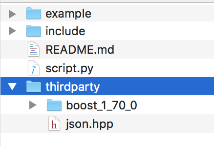
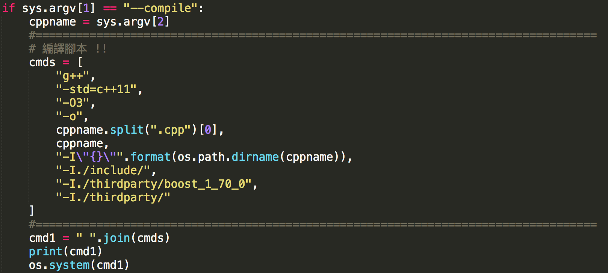
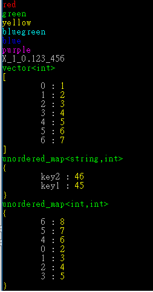
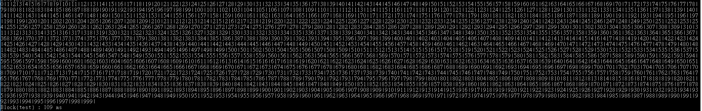
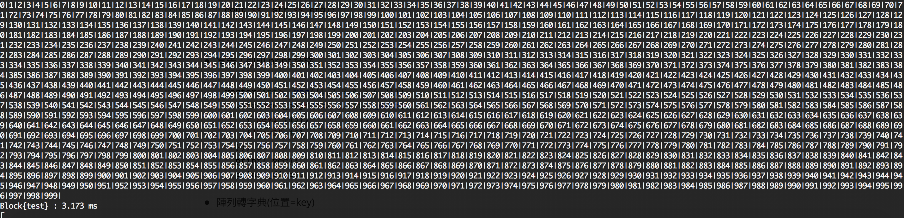
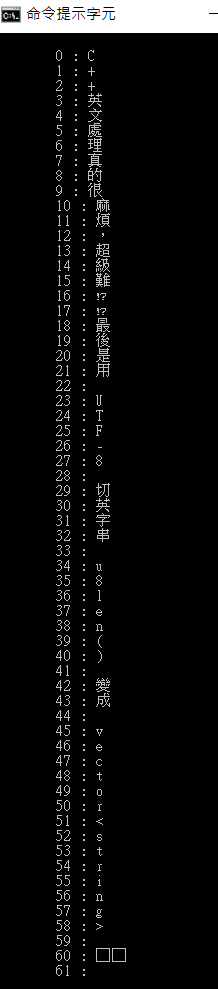
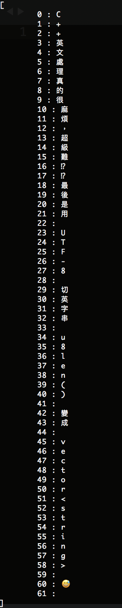
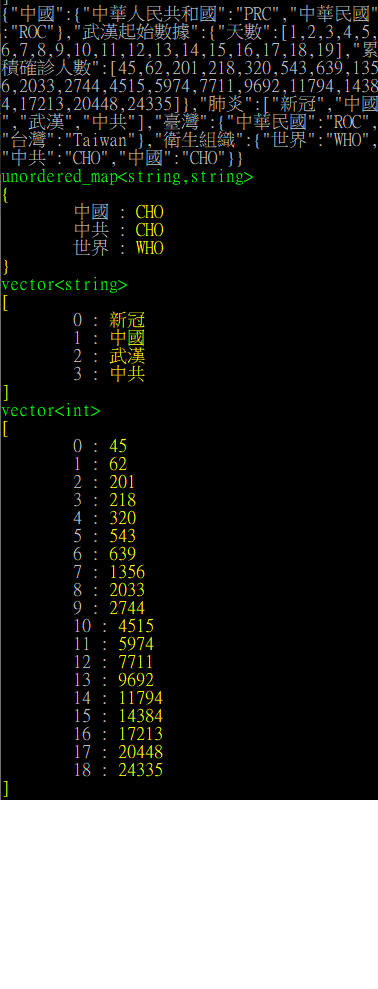
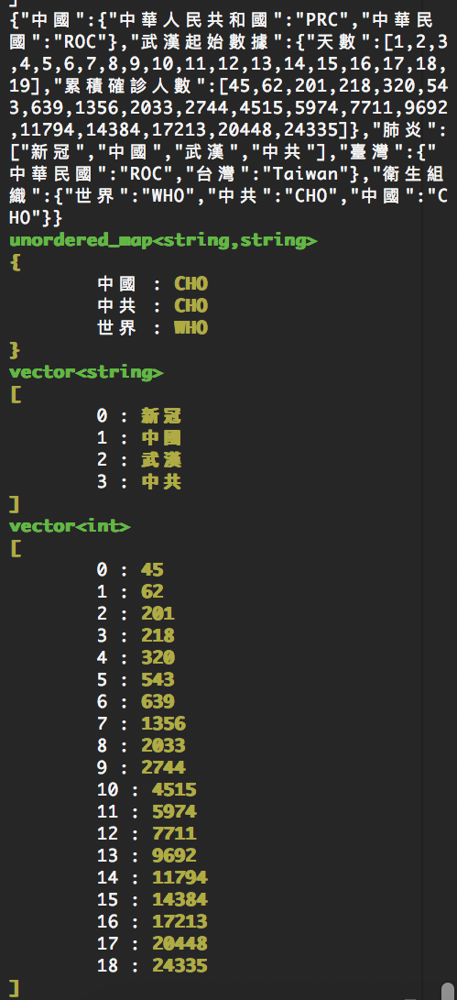

### DIYCXX 專案概述 

=================================================

開發階段中～函式名稱，結構隨時有可能改變，僅供參考 !!

=================================================

 - 作者: Plus & Minus

- 更新日期: 2020.04.11

 - 這是嘗試讓 C++ 一些易用輔助開發的函式庫

 - **headfile-only**  都在 include/*  

   ```c++
   #include "cxxuseful.hpp"
   using namespace cxxuseful;
   /* your codes */
   ```

- 詳細用法可見 example/hello.cpp 實作或是各 .hpp 置頂註解


### 測試環境 (作業系統 / **終端機** / 編譯器)

- Windows10  g++ (x86_64-posix-seh-rev0, Built by MinGW-W64 project) 8.1.0  ([CodeBlocks](http://www.codeblocks.org/) 20.03)

  ​	- [如何讓 CodeBlocks g++ 在 windows cmd 呼叫得到 ??](https://www.youtube.com/watch?v=9aHXNGrpTuM)

- ubuntu18.04 from wsl (windows subsystem for linux)  ([GNU](https://gcc.gnu.org/)  g++ 4.8.5)

  ​	[-如何在 windows 上安裝 wsl 來得到 linux 系統??](https://blog.miniasp.com/post/2019/02/01/Useful-tool-WSL-Windows-Subsystem-for-Linux)

- mac os  , Apple LLVM version 10.0.0 (clang-1000.10.44.4)  ([Xcode](https://developer.apple.com/xcode/) 10)

### 函式庫需求(預先安裝)

- 把以下的函式庫下載到 thirdparty/ ，完成後類似下圖

  

- 第三方函式庫資訊:

  | 函式庫名                                                     | 資料夾/檔名   | 用途                |
  | ------------------------------------------------------------ | ------------- | ------------------- |
  | [boost](<https://www.boost.org/>)                            | boost_X_X_X/* | 可視為 STL 擴展函式 |
  | [json](<https://github.com/nlohmann/json/tree/develop/single_include/nlohmann>) | json.hpp      | 處理 json 結構      |
  |                                                              |               |                     |


### 編譯指令 

直接透過 g++

```shell
g++ -std=c++11 -O3 -o {your.cpp} -I"{yourpath}/include/" -I"{yourpath}/thirdparty/{project_name}"
```

或是透過 python 腳本編譯+試跑，

```shell
python script.py --compile {your.cpp}
python script.py --run {your.cpp}
```

若要修改編譯器指令，可參考  script.py 的 cmds 如下圖:



### include/*.hpp 檔案說明

| hpp 檔名           | 實體物件名 | 說明                                |
| ------------------ | ----------------------------------- | ----------------------------------- |
| cxxuseful.hpp     | -    | 關於此專案所有 header 引用(包含 STL,Boost,DIY) |
| boost_includes.hpp | - | 關於此專案會需要用到的 boost 函式庫 |
| timer.hpp | - |程式區塊計時相關|
| printfunc.hpp      | print | 列印結構相關           |
| cmdcolor.hpp       | printXXX | 關於在終端機上顯示彩色字串 XXX = { Red , Yellow , Blue , Green ...} |
| makedictfunc.hpp| mkdict | 結構轉 unordered_map 相關|
| jsonfunc.hpp | jsonfc | json 處理相關 |
| randomfunc.hpp | randfc | 亂數產生模擬相關 |
| strhandler.hpp | shlr | 字串輔助相關 |
| utf8str.hpp| - | unicode , 中文字串切割相關|
| otherfunc.hpp| otherfc |已實作但無法分類區|


### 範例:  hello.cpp

- 終端機顯示彩色 string 

  ```cpp
  printRed("red",true);
  printGreen("green",true);
  printYellow("yellow",true);
  printBlueGreen("bluegreen",true);
  printBlue("blue",true);
  printPurple("purple",true);
  ```


- 混雜型別轉字串 (尚未支援中文)

  ```cpp
  string _str = shlr({1,0.123,"456"},/*分割元*/"_",/*head*/"X");
  cout << _str << endl;
  ```

- 宣告 / 列印 print 結構 

  ```cpp
  vector<int> _vec({1,2,3,4,5,6,7});
  	unordered_map<string,int> _dict({
  		{"key1",45},
  		{"key2",46}
  	});
  	print(_vec);
  	print(_dict);
  ```

- 陣列轉字典(位置=key)

  ```cpp
  basic_string<int> _bas({2,3,4,5,6,7,8});
  auto _dictBastr = type<unordered_map<int,int> >(mkdict(_bas));
  print(_dictBastr);
  ```

  | Windows cmd              | MAC TERMINAL          |
  | ------------------------ | --------------------- |
  |  |  |

- 程式區塊計時

  ```cpp
  { // 計時開始
  		Timer timer("test");
  		for(int i=0;i<1000;i++){
  			cerr << i << "|";
  		}
  		cerr << endl;
  }//計時結束
  ```

  | Windows CMD              |
  | ------------------------ |
  |  |
  | MAC TERMINAL             |
  |     |


- utf8 中文處理/顯示   

  ```cpp
  // 註: IDE/文字編輯器 , 觀看 hello.cpp 需要為 utf8編碼 
  string _cxxstr = "C++中文處理真的很麻煩，超級難⁉⁉最後是用 UTF-8 切中字串 u8len() 變成 vector<string> 😅 ";
  utf8 _cxxstr2 = s2u8(_cxxstr); // utf8 本質上為 vector<string>
  // 把字串裡的"中"字改成"英"
  for(int i=0;i<_cxxstr2.size();i++){
  		if(_cxxstr2[i] == "中"){
  			_cxxstr2[i] = "英";
  		}//endif
  }//endfor
  print_utf8(_cxxstr2);
  ```
  | Windows cmd  預設 Big5(950) | Mac terminal          |
  | --------------------------- | --------------------- |
  |     |  |

  ===========================================

  Trick 筆記 :  windows  cmd 保險輸出中文(UTF8)方法

  ===========================================

  ```cpp
  // 步驟1. 在 windows cmd 字串前面加入 "空格退格" , 實作在 utf8str.hpp
  string wintrick(const string& str){
  	return " \b"+str;
  }
  // 步驟2. 調整模式至 utf8 (65001) 在調回預設(950) , 實作在 printfunc.hpp
  void print(const &str){
      #if defined _WIN32 || defined _WIN64
          SetConsoleOutputCP(65001); 
      #endif
      cout << wintrick(str) << endl;
      #if defined _WIN32 || defined _WIN64
          SetConsoleOutputCP(950); 
      #endif
  }
  ```

- 讀 json 檔 (./example/politics.json)

  ```cpp
  json j;
  j = jsonfc.read("./example/politics.json");
  // cout << j << endl;  // 有的 windows cmd 會有 bug !!
  unordered_map<string,string> cov = jsonfc.dict<string,string>(j["衛生組織"]); 
  vector<string> who = jsonfc.list<string>(j["肺炎"]);
  vector<int> sicks = jsonfc.list<int>(j["武漢起始數據"]["累積確診人數"]);
  print(cov);
  print(who);
  print(sicks);
  ```

  | Windows cmd              | Mac terminal          |
  | ------------------------ | --------------------- |
  |  |  |

